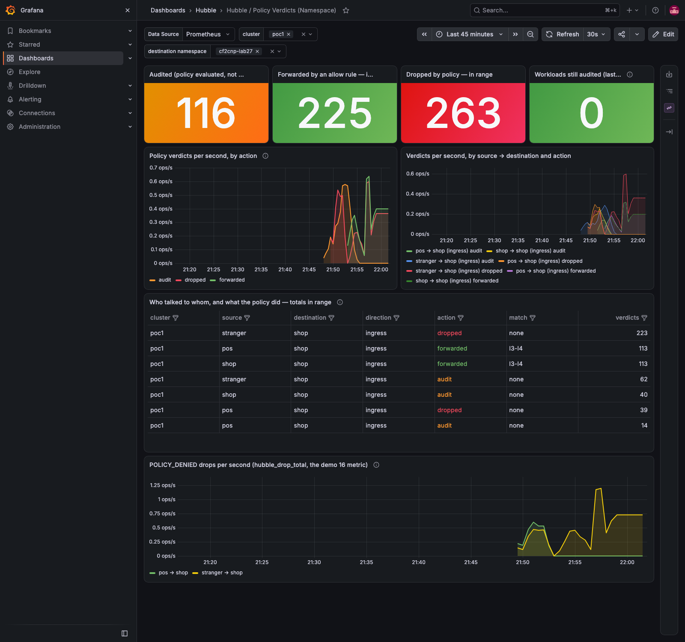

# hubble-policy-verdicts

One Grafana dashboard, **Hubble / Policy Verdicts (Namespace)**, delivered as a Helm chart: the network-policy
verdicts Cilium's Hubble counts — **audited** (policy evaluated, not enforced), **forwarded** (an allow rule
matched) and **dropped** (enforced) — per namespace, per source → destination, with the drop metric beside
them. It is the "observe first, then enforce" picture: the audit line rising while nothing is dropped, then
dropped appearing where audit stops.



Born in [cilium-implementation-poc, demo 26](https://github.com/ephico2real2/cilium-implementation-poc/tree/main/demos/26-cf2cnp-policy-from-flows)
and put to work in [demo 27](https://github.com/ephico2real2/cilium-implementation-poc/tree/main/demos/27-cf2cnp-release);
the chart's story is [demo 28](https://github.com/ephico2real2/cilium-implementation-poc/tree/main/demos/28-policy-verdicts-chart).

## Prerequisite: Hubble's `policy` metric

The panels read `hubble_policy_verdicts_total` (labels `action`, `match`, `direction`, `source`, `destination`,
`source_namespace`, `destination_namespace`) and `hubble_drop_total`. Enable the metric with the contexts
the panels use — in Cilium's Helm values (the dynamic exporter re-reads the ConfigMap, no agent restart):

```yaml
hubble:
  metrics:
    enabled: []            # the list moved to the dynamic config below
    dynamic:
      enabled: true
      config:
        content:
          - name: policy
            contextOptions:
              - {name: sourceContext,      values: [app, workload-name, reserved-identity]}
              - {name: destinationContext, values: [app, workload-name, reserved-identity]}
              - {name: labelsContext,      values: [source_namespace, destination_namespace]}
          - name: drop
            contextOptions:
              - {name: sourceContext,      values: [app, workload-name, reserved-identity]}
              - {name: destinationContext, values: [app, workload-name, reserved-identity]}
              - {name: labelsContext,      values: [source_namespace, destination_namespace]}
```

and a Prometheus that scrapes the agents' `hubble-metrics` port (kube-prometheus-stack + Cilium's
`hubble.metrics.serviceMonitor.enabled: true`). The `destination` context is the *application* (the `app` /
`app.kubernetes.io/name` label), so two components of one application read as one destination here — the
policy names keep them apart.

## Install

Sidecar (kube-prometheus-stack; the sidecar watches every namespace by default):

```bash
helm repo add hubble-policy-verdicts https://ephico2real2.github.io/hubble-policy-verdicts
helm install hubble-policy-verdicts hubble-policy-verdicts/hubble-policy-verdicts -n monitoring
```

Grafana Operator:

```bash
helm install hubble-policy-verdicts hubble-policy-verdicts/hubble-policy-verdicts -n grafana \
  --set sidecar.enabled=false --set grafanaOperator.enabled=true
```

| Value | Default | Meaning |
|---|---|---|
| `nameOverride` | `hubble-policy-verdicts` | the object's name (never derived from the chart alias) |
| `dashboard.folder` | `Hubble` | Grafana folder (the sidecar's folder annotation / the operator's `folder`) |
| `dashboard.labels` | `{}` | extra labels on the object |
| `sidecar.enabled` | `true` | render a ConfigMap for the Grafana dashboard sidecar |
| `sidecar.label`, `sidecar.labelValue` | `grafana_dashboard`, `"1"` | the label the sidecar selects on |
| `sidecar.folderAnnotation` | `grafana_folder` | the annotation naming the folder |
| `sidecar.namespace` | release namespace | where the ConfigMap goes (set it when the sidecar watches one namespace) |
| `grafanaOperator.enabled` | `false` | render a `GrafanaDashboard` (grafana.integreatly.org/v1beta1) instead / as well |
| `lokiRow.enabled`, `lokiRow.cf2cnpURL`, `lokiRow.observerNamespace` | add the Loki-backed dropped-flow table with the cf2cnp actions under the verdict panels (needs the hubble-observer stream in Loki) | `false`, `https://cf2cnp.example.com`, `hubble-observer` |
| `grafanaOperator.instanceSelector` | `{matchLabels: {grafanaInstance: main}}` | which Grafana the operator applies it to |

As a dependency of another chart (the way [hubble-observer](https://github.com/onzack/hubble-observer) ships the
Cilium Flows dashboard):

```yaml
dependencies:
  - name: hubble-policy-verdicts
    alias: policyVerdictsDashboard
    version: "0.1.1"
    repository: https://ephico2real2.github.io/hubble-policy-verdicts
    condition: policyVerdictsDashboard.enabled
```

## Panels

| Panel | Query | Reads as |
|---|---|---|
| Audited / Forwarded / Dropped in range | `sum(increase(hubble_policy_verdicts_total{action="…"}[$__range]))` | the three phases as three numbers |
| Workloads still audited (last 5 min) | `count(sum(rate(…{action="audit"}[5m])) by (destination) > 0)` | orange while anything is still observing |
| Policy verdicts per second, by action | `sum(rate(…[$__rate_interval])) by (action)` | audit rising then vanishing, dropped appearing = enforcement |
| by source → destination and action | `… by (source, destination, direction, action)` | who is affected |
| Who talked to whom, and what the policy did | `sum(increase(…[$__range])) by (cluster, source, destination, direction, action, match)` | `match=none` = the default-deny decided; `l3-l4` / `l7/http` / `l7/dns` = the rule kind that allowed |
| POLICY_DENIED drops per second | `hubble_drop_total{reason="POLICY_DENIED"}` | the drop metric beside the audit line |

Variables: `DS_PROMETHEUS` (datasource), `cluster` and `namespace` (destination namespace) from the metric's labels.

## License

Apache-2.0.
